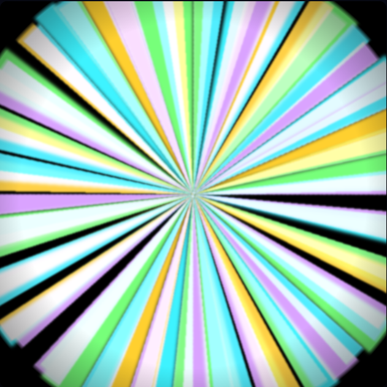

# Kaleidoscope (CSS-only)

A CSS-only kaleidoscope built with layered `repeating-conic-gradient` patterns, masking, and blend modes. Includes a subtle grain texture and reduced-motion fallback. No JavaScript.

## Demo

- Open: `Kaleidoscope/index.html`

## Preview

<video src="./Kaleidoscope.mp4" controls width="640" poster="../images/kaleidoscope.png">
  Your browser does not support the video tag.
</video>

## Files

- `index.html` – markup scaffold
- `style.css` – gradient layers, masks, animations
- `Kaleidoscope.mp4` – short preview video (optional)

## Notes

- Animations respect `prefers-reduced-motion`.
- Works across modern browsers; performance can be tuned by reducing blur or animation durations in `style.css`.
