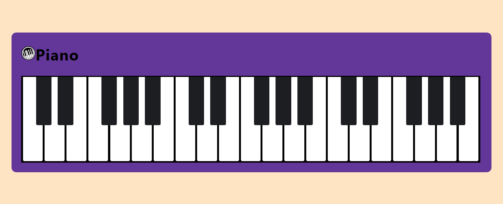

# Piano (HTML/CSS Only)

A simple, responsive CSS-only piano keyboard UI built with pure HTML and CSS. No JavaScript.

## Preview

## Usage

- Open `Piano/index.html` in your browser.
- Assets:
  - `Piano/piano.css`
  - `Piano/piano-logo.png`

## Notes

- Designed to align with the repository’s style and licensing (GPL-3.0).
