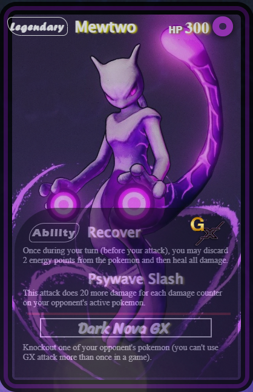

# Mewtwo Pokémon Card (CSS-only)

A CSS-only Pokémon card featuring Mewtwo. Built with pure HTML and CSS, custom webfonts, and layered imagery. No JavaScript.

## Demo

- Open the live demo page: `Pokemon-Mewtwo-Card/mewtwo.html`

## Preview

<video src="./Mewtwo.mp4" controls width="640" poster="../images/mewtwo-card.png">
  Your browser does not support the video tag.
</video>

## Files

- `mewtwo.html` – markup for the card
- `mewtwo.css` – styling for layout, fonts, and effects
- `mewtwo1.jpeg` – Mewtwo artwork
- `pokeball.png` – favicon
- `dark.gif` – background
- `G-letter.png`, `X1.png` – GX badge images
- `fonts/` – bundled webfonts used by the card

## Credits

- Made by **SamXop123** – https://github.com/SamXop123
- Assets included for demo purposes per repository license guidelines.

## License

This demo is contributed under the project license (**GPL-3.0**). See the root `LICENSE` file for details.
