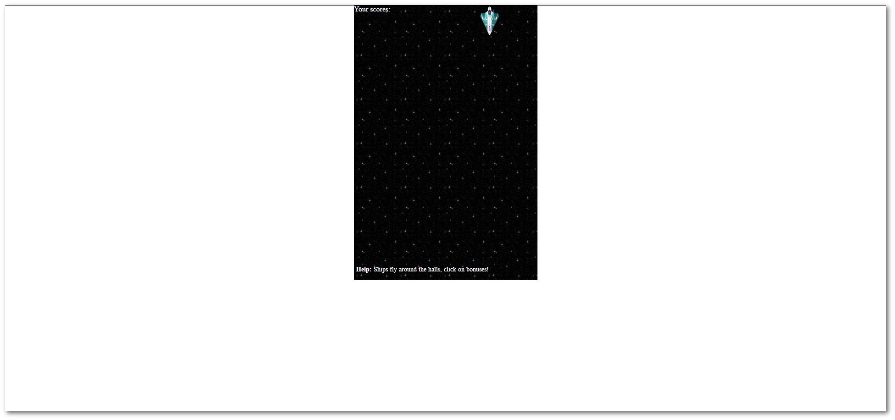
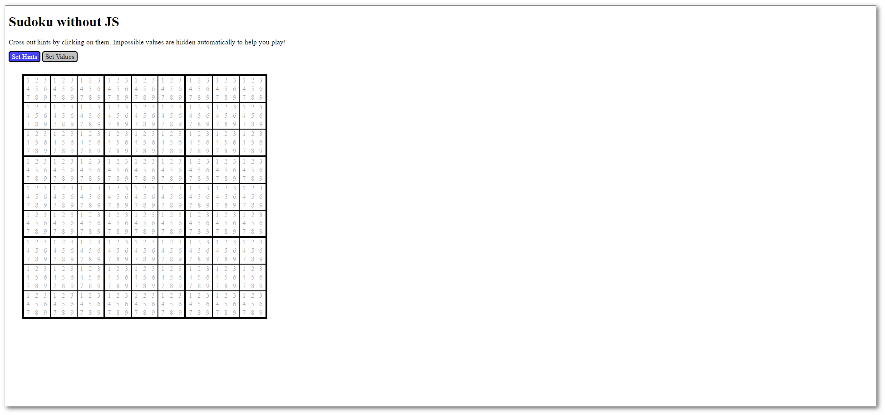

# You Don't Need JavaScript

Please note these demos should be considered as CSS "Proofs of Concepts". They may have serious issues from accessibility point of view (keyboard navigation, speech synthesis, etc.), or progressive enhancement/degradation/etc.


### Style Guide:

```markdown
## Subject

[](http://url-to-page)
[](http://url-to-page)
[](http://url-to-page)

***
&nbsp;
```

***
&nbsp;

## Accordion / Toggle

[](http://www.mraffaele.com/labs/css-only-accordions/)
[](http://codepen.io/cristina-silva/pen/pyXQrj)
[](http://codepen.io/PaulZi/pen/zBbVvV)

***
&nbsp;

## Carousel

[](http://codepen.io/SitePoint/pen/MyPVdK)
[](https://codepen.io/cavico/pen/yOjwya)

***
&nbsp;

## Counter of checked check-boxes

[](https://codepen.io/anon/pen/eZWXOZ)

***
&nbsp;

## Flip on click

[](https://codepen.io/RuudBurger/pen/bwjry)

***
&nbsp;

## Floating label on Textfield

[](http://codepen.io/KtorZ/pen/ZOzdqG)

***
&nbsp;

## Font-Face (Latin)

[](https://yusugomori.com/projects/css-sans/fonts)

***
&nbsp;

## Games

[](https://codepen.io/i0z/pen/mFLCw)
[](https://codepen.io/TabAtkins/pen/JYZgRo)

***
&nbsp;

## Info on hover/ Popover

[](https://codepen.io/guuslieben/pen/gabQWM)
[](http://codepen.io/cristina-silva/pen/XXOpga)

***
&nbsp;

## Image Gallery
[](https://codepen.io/shaishgandhi/pen/yJzamw)
[](http://codepen.io/pavlovsk/pen/sjubp)

***
&nbsp;

## Loaders

[](http://codepen.io/lucadem1313/pen/vKWqRV)
[](http://codepen.io/lucadem1313/pen/XKzLER)
[](http://codepen.io/brunjo/pen/xbwVXJ)
[](http://codepen.io/brunjo/pen/ByjRPy)
[](http://codepen.io/brunjo/pen/LEGyrJ)
[](http://codepen.io/brunjo/pen/bNEWjV)
[](http://codepen.io/brunjo/pen/wBKmbm)
[](http://tobiasahlin.com/spinkit/)
[](http://codepen.io/viduthalai1947/pen/JkhDK)

***
&nbsp;

## Menu

[](https://codepen.io/antoniputra/pen/BzyWmb)
[](http://codepen.io/cristina-silva/pen/NNOodj)

***
&nbsp;

## Mobile menu off canvas

[](https://codepen.io/fabricionaweb/pen/xOLwxj)

***
&nbsp;

## Modal/Popup

[](https://codepen.io/peiche/pen/vhqym)
[](https://codepen.io/chrisburnell/pen/scyKF)

***
&nbsp;

## Mouse tracking

[](https://codepen.io/Momciloo/pen/GoGRrQ)

***
&nbsp;

## Parallax scrolling

[](http://keithclark.co.uk/articles/pure-css-parallax-websites/demo3/)

***
&nbsp;

## Tabs

[](https://codepen.io/llgruff/pen/ZGBxOa)
[](https://codepen.io/fusco/pen/Wvzjrm)

***
&nbsp;

## Todo List
[](http://codepen.io/scryptonite/pen/oLGzdj)

***
&nbsp;

## Tooltips
+ [Demo](https://kushagragour.in/lab/hint/)

## Treeview

[](https://codepen.io/rgg/pen/WrKyzj)

***
&nbsp;

##Twitter Heart Animation

[](http://codepen.io/thebabydino/pen/RRRRZE)

***
&nbsp;

## Contribute

Please give me a hand.
