English | [简体中文](./README-zh_CN.md)

# You Don't Need JavaScript

[](https://dev.to/t/javascript)

Please be aware that the demos may exhibit significant accessibility issues, such as problems with keyboard navigation, speech synthesis, and progressive enhancement or degradation.

### Style Guide:

```markdown
## <a id="DemoSubject"></a>Carousel

[](http://url-to-page)
[](http://url-to-page)
[](http://url-to-page)

**[⬆ back to top](#quick-links)**
```

---

## Quick Links

- [3D Effects & Animations](#3d-effects--animations)
- [Buttons & Interactive Elements](#buttons--interactive-elements)
- [Navigation & Menus](#navigation--menus)
- [Loaders & Progress Indicators](#loaders--progress-indicators)
- [CSS-Only Interactive Components](#css-only-interactive-components)
- [Cards & Layout Components](#cards--layout-components)
- [Accordions & FAQ Sections](#accordions--faq-sections)
- [Text Effects & Typography](#text-effects--typography)
- [Sliders & Carousels](#sliders--carousels)
- [Layout & Grid Systems](#layout--grid-systems)
- [Form Elements & Input Effects](#form-elements--input-effects)
- [Games & Interactive Demos](#games--interactive-demos)
- [Website Templates & Full Pages](#website-templates--full-pages)
- [Animation Effects](#animation-effects)
- [Visual Effects & Graphics](#visual-effects--graphics)
- [Scroll Effects](#scroll-effects)
- [Special Components](#special-components)
- [App Clones & Showcases](#app-clones--showcases)
- [Physics & Science Animations](#physics--science-animations)
- [UI Components](#ui-components)
- [Mobile Design](#mobile-design)
- [Music & Entertainment](#music--entertainment)
- [Educational & Tutorials](#educational--tutorials)
- [Resources](#resources)
- **Contribution**
  - [Contributors](#contributors)
  - [Contributing](#contributing)

---

## <a id="3d-effects--animations"></a>3D Effects & Animations

[](3D%20Earth/index.html)
[](3D%20Flipping%20Card%20Component/index.html)
[](3D%20Rotating%20Cube/index.html)
[](3D%20Rotation%20Square/index.html)
[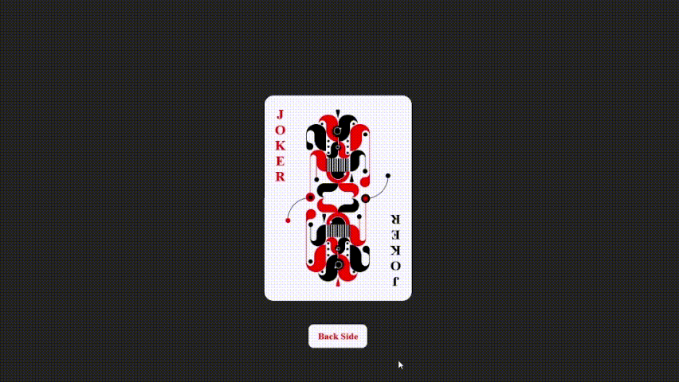](3D%20card%20flip%20animation/index.html)
[](3D%20transform/index.html)
[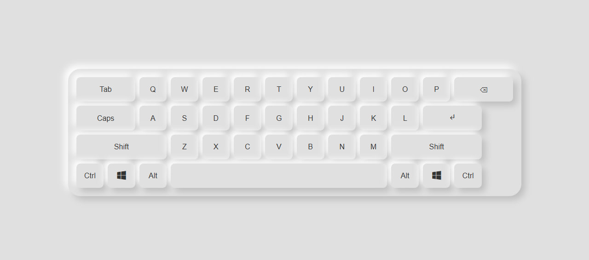](3d_virtual_keyboard/index.html)
[](Cube%20360%20view/index.html)

**[⬆ back to top](#quick-links)**

---

## <a id="buttons--interactive-elements"></a>Buttons & Interactive Elements

[](Animated%20Submit%20Button/index.html)
[](Button/Animated-Button/index.html)
[](Button/Liquid-Button/index.html)
[](Button/Sliced-Button/index.html)
[](Button%20Neon/index.html)
[](Button/Shake-Button/index.html)

**[⬆ back to top](#quick-links)**

---

## <a id="navigation--menus"></a>Navigation & Menus

[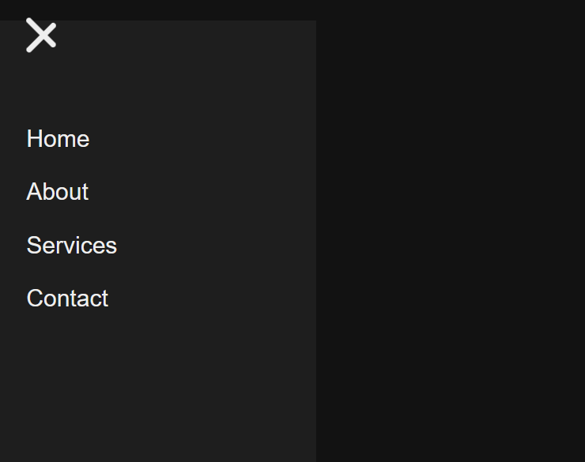](Hamburger-Menu/index.html)
[](Animated%20Navigation%20Menu-tutorial/index.html)
[](Responsive%20navbar/index.html)
[](NavBar/Burger-Menu/index.html)
[](NavBar/Fancy-Menu/index.html)
[](NavBar/Dropdown-Menu/index.html)

**[⬆ back to top](#quick-links)**

---

## <a id="loaders--progress-indicators"></a>Loaders & Progress Indicators

[](Animated%20Loading%20Page/index.html)
[](Simple%20Loader/index.html)
[](circular-progress-bar-loader/index.html)
[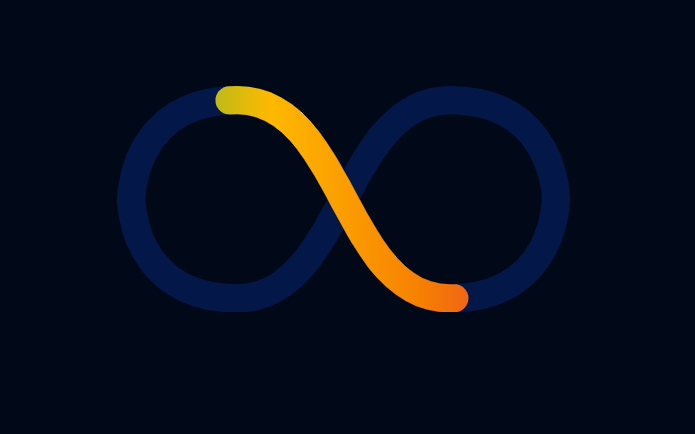](new_Loader/index.html)
[](CompassLoader/index.html)
[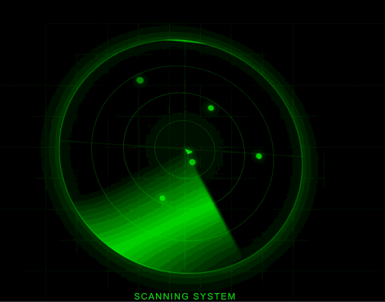](Redar%20Loader/index.html)
[](Progressbar%20On%20Scroll/index.html)

**[⬆ back to top](#quick-links)**

---

## <a id="css-only-interactive-components"></a>CSS-Only Interactive Components

[](css-only-calculator/index.html)
[](css-only-coin-flip/index.html)
[](css-only-equalizer/index.html)
[](css-only-modal/index.html)
[](css-only-pricing-table/index.html)
[](css-only-star-rating/index.html)
[](css-only-step-progress/index.html)

**[⬆ back to top](#quick-links)**

---

## <a id="cards--layout-components"></a>Cards & Layout Components

[](Blinking%20Card/index.html)
[](responsive-card/index.html)
[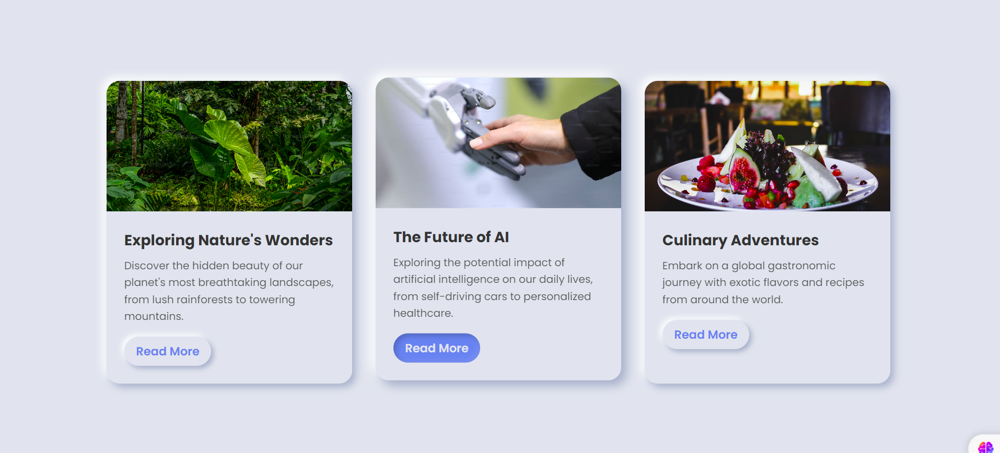](BLOG%20POST%20CARDS/neuo/index.html)
[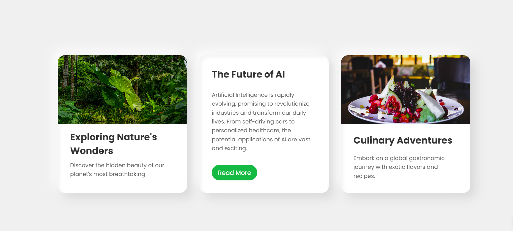](BLOG%20POST%20CARDS/clay/index.html)
[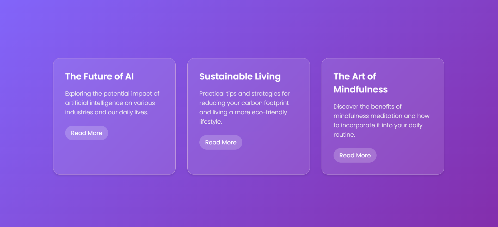](BLOG%20POST%20CARDS/glass/index.html)
[](Cards/Neumorphism-Card/index.html)

**[⬆ back to top](#quick-links)**

---

## <a id="accordions--faq-sections"></a>Accordions & FAQ Sections

[](Accordion%20Projects/index.html)
[](Modern-Accordion-and-FAQ/index.html)
[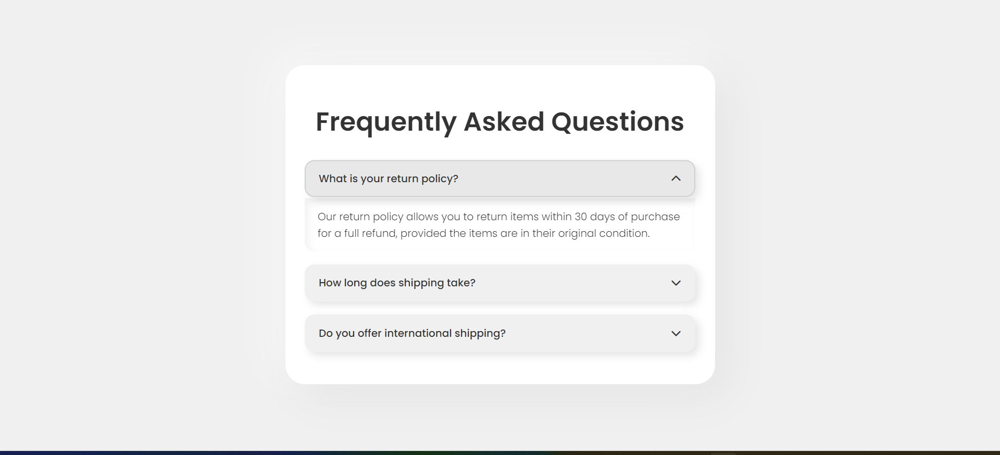](FAQ%20SECTION/clay/index.html)
[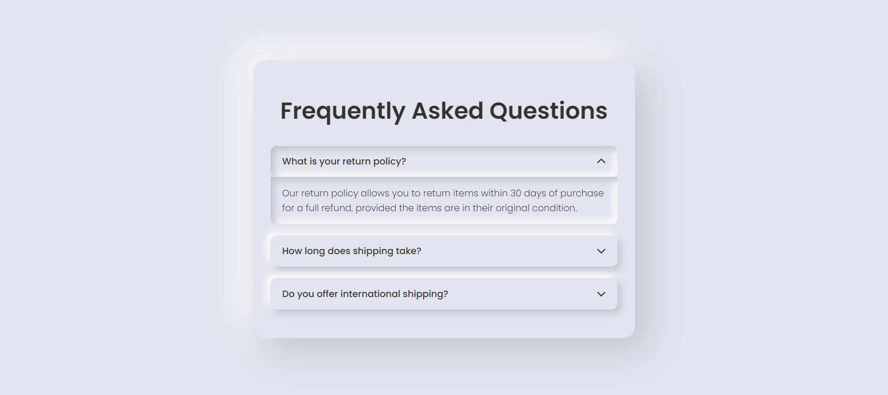](FAQ%20SECTION/neuo/index.html)
[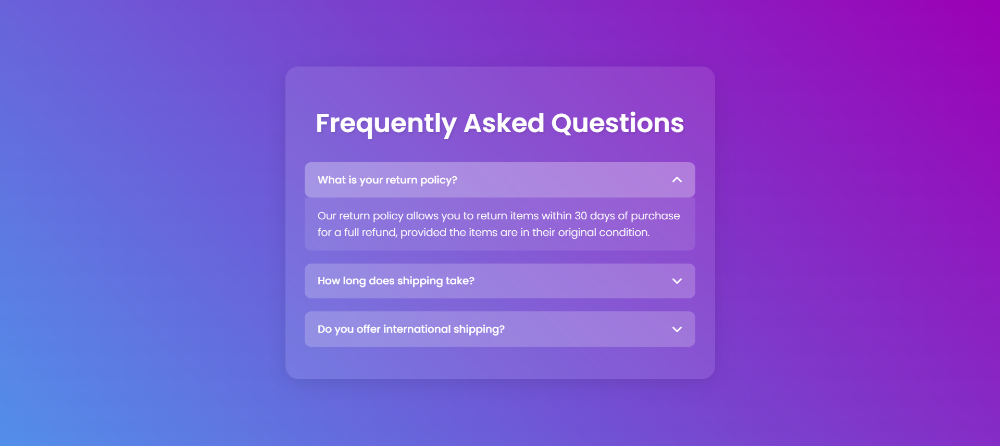](FAQ%20SECTION/glass/index.html)

**[⬆ back to top](#quick-links)**

---

## <a id="text-effects--typography"></a>Text Effects & Typography

[](Animated-Text/index.html)
[](TypeWriter%20Effect/index.html)
[](distorted-text-animation/index.html)
[](examples/font-face/index.html)

**[⬆ back to top](#quick-links)**

---

## <a id="sliders--carousels"></a>Sliders & Carousels

[](Animated%20Slider/index.html)
[](infinitecarousel/index.html)
[](Slideshow/index.html)
[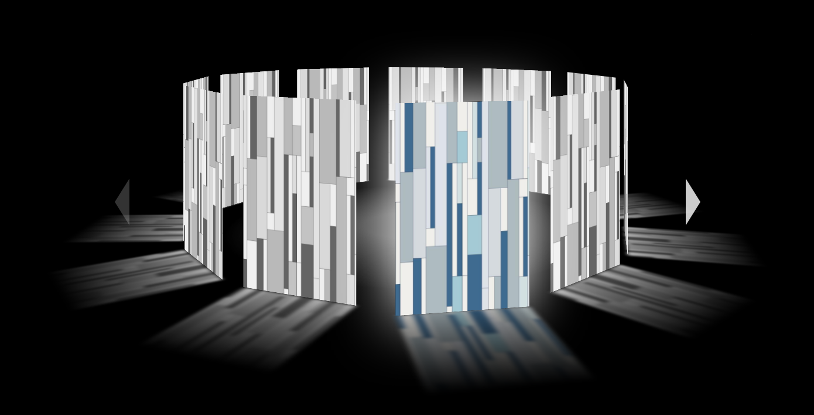](carousel_effect/index.html)
[](Horizontal%20image%20slider/index.html)

**[⬆ back to top](#quick-links)**

---

## <a id="layout--grid-systems"></a>Layout & Grid Systems

[](CSS-Grid%20Layout%20Generator/index.html)
[](flex%20Property/index.html)
[](grid/index.html)
[](z%20indexing/index.html)

**[⬆ back to top](#quick-links)**

---

## <a id="form-elements--input-effects"></a>Form Elements & Input Effects

[](Glassmorphism%20login%20page/index.html)
[](Login/Floating-Label/index.html)
[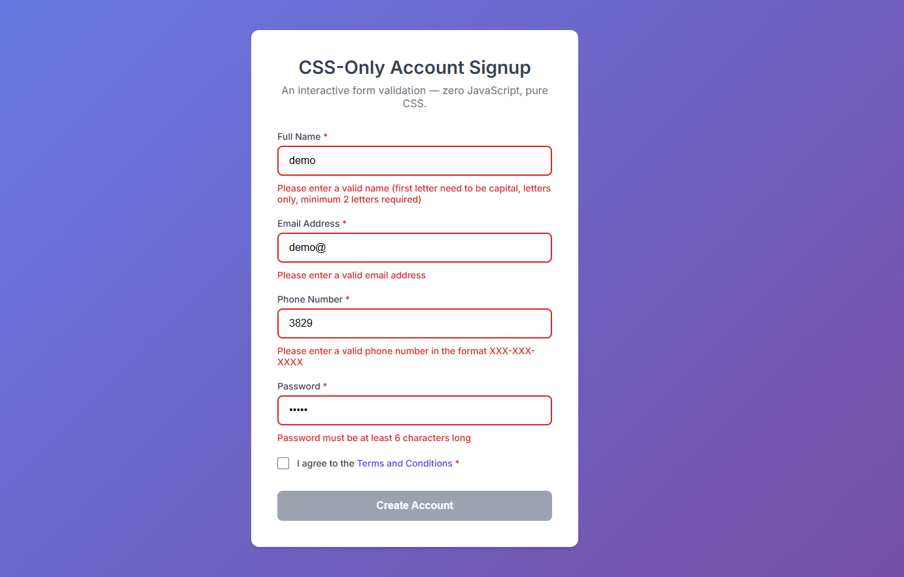](CSS-Form-Handling/index.html)
[](Login_Page/index.html)

**[⬆ back to top](#quick-links)**

---

## <a id="games--interactive-demos"></a>Games & Interactive Demos

[](RGBcolorgame/index.html)
[](examples/todo-list/index.html)

**[⬆ back to top](#quick-links)**

---

## <a id="website-templates--full-pages"></a>Website Templates & Full Pages

[](Bitcoin-website/index.html)
[](Landing%20Page/index.html)
[](Portfoliowebsite/index.html)
[](Online_Book_Shop/index.html)
[](Weather/index.html)
[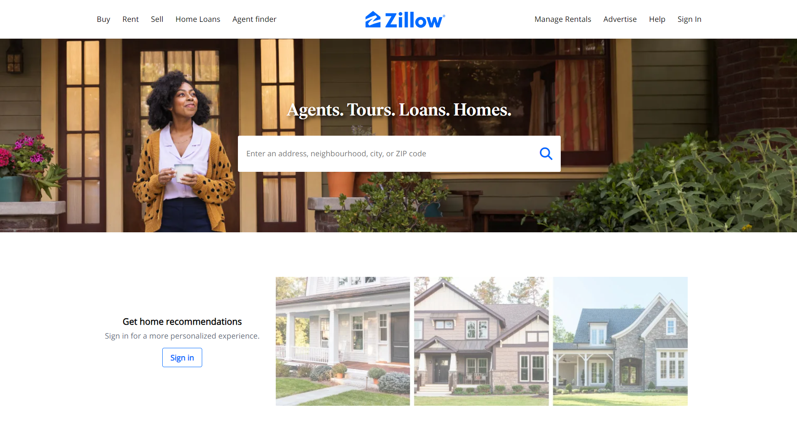](Web_Demo/index.html)
[](Motivational-quote-wall/index.html)
[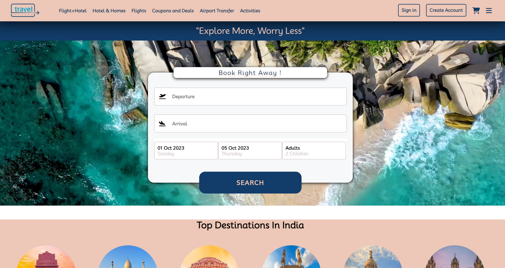](Travelling%20Website/index.html)

**[⬆ back to top](#quick-links)**

---

## <a id="animation-effects"></a>Animation Effects

[](Advanced%20Dancing%20Animation-tutorial/index.html)
[](Dancing%20Alphabets/index.html)
[](CodePenAnimation/index.html)
[](animation-box%20tutorial/index.html)
[](animations/index.html)
[](leaf-anim/index.html)
[](Square%20Animation/index.html)
[](Square_Rotation_Animation/index.html)
[](Book%20Animation/index.html)
[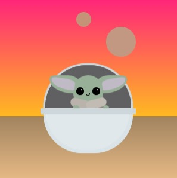](Baby%20Yoda%20Animation/index.html)

**[⬆ back to top](#quick-links)**

---

## <a id="visual-effects--graphics"></a>Visual Effects & Graphics

[](Flowers/index.html)
[](lighting_decor/index.html)
[](watch_art/index.html)
[](solar%20system%20art/index.html)
[](SolarSystem/index.html)
[](Captain%20America%20Shield/index.html)

**[⬆ back to top](#quick-links)**

---

## <a id="scroll-effects"></a>Scroll Effects

[](Scroll-Unblur-Text-Effect/index.html)
[](Scroll-Video-Animation/index.html)
[](Parallax%20Effect%20Scroll/index.html)
[](Parallax_Effect/index.html)
[](examples/parallax-scrolling/index.html)

**[⬆ back to top](#quick-links)**

---

## <a id="special-components"></a>Special Components

[](Search-bar%20and%20Tweet/index.html)
[](ToolTip%20with%20Delay/index.html)
[](stickyheader/index.html)
[](Cursor/index.html)
[](Shapes/index.html)
[](examples/tooltips/index.html)
[](examples/tabs/index.html)

**[⬆ back to top](#quick-links)**

---

## <a id="app-clones--showcases"></a>App Clones & Showcases

[](NETFLIX%20CLONE/index.html)
[](Netflix-Clone-v2/index.html)
[](MasteCard/index.html)
[](Implement%20Interactive%20Tech%20Showcase%20Cards/index.html)
[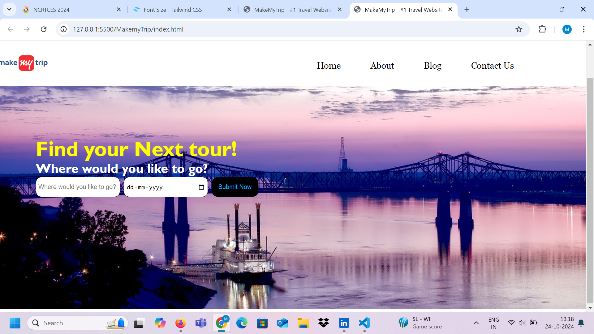](MakemyTrip/index.html)
[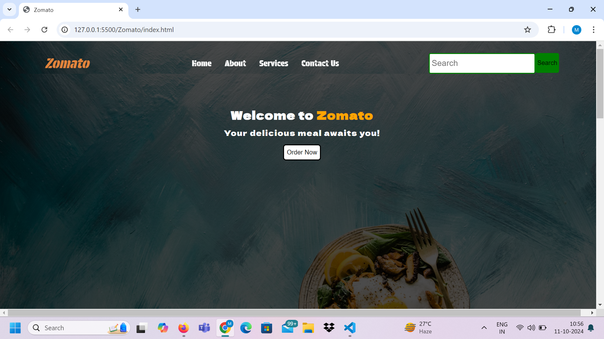](Zomato/index.html)

**[⬆ back to top](#quick-links)**

---

## <a id="physics--science-animations"></a>Physics & Science Animations

[](Newtons%20Cradle/index.html)
[](Pendulum/index.html)

**[⬆ back to top](#quick-links)**

---

## <a id="ui-components"></a>UI Components

[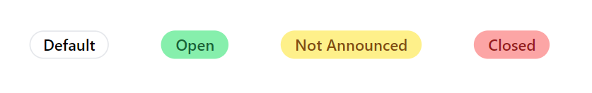](Badges/index.html)
[](Sliding%20Images%20and%20NavBar/index.html)
[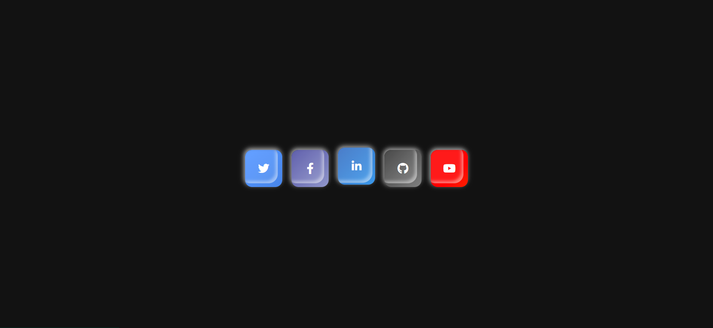](Social_media_icons/index.html)
[](Responsive%20Footer/index.html)

**[⬆ back to top](#quick-links)**

---

## <a id="mobile-design"></a>Mobile Design

[](Animated_Iphone_design/index.html)

**[⬆ back to top](#quick-links)**

---

## <a id="music--entertainment"></a>Music & Entertainment

[](Music/index.html)

**[⬆ back to top](#quick-links)**

---

## <a id="educational--tutorials"></a>Educational & Tutorials

[](Top%2010/index.html)

**[⬆ back to top](#quick-links)**

---

## <a id="resources"></a>Resources

[](download_buttons/index.html)

**[⬆ back to top](#quick-links)**

---

## Contributors

Thanks to these wonderful people who have contributed to this project!

<a href="https://github.com/you-dont-need/You-Dont-Need-JavaScript/graphs/contributors">
  
</a>

## Contributing

We welcome contributions from the community to make this project better. Feel free to fork the repository, make your changes, and submit a pull request. Be sure to follow our [Code of Conduct](CODE_OF_CONDUCT.md).

For detailed guidelines on how to contribute, please refer to our [CONTRIBUTING](CONTRIBUTING.md) file.

**[⬆ back to top](#quick-links)**

Let's build something great together!

## License

This project is licensed under the **GNU General Public License v3.0 (GPL-3.0)** — see the [LICENSE](LICENSE) file for details.
