English | [简体中文](./README-zh_CN.md)

# You Don't Need JavaScript

[](https://dev.to/t/javascript)

Please be aware that the demos may exhibit significant accessibility issues, such as problems with keyboard navigation, speech synthesis, and progressive enhancement or degradation.

### Style Guide:

```markdown
## <a id="DemoSubject"></a>Carousel

[](http://url-to-page)
[](http://url-to-page)
[](http://url-to-page)

**[⬆ back to top](#quick-links)**
```

---

&nbsp;

## Quick links

- [You Don't Need JavaScript](#you-dont-need-javascript)
- [Style Guide:](#style-guide)
- [Quick links](#quick-links)
- [Accordion / Toggle](#accordion--toggle)
- [Analog-clock](#analogclock)
- [Animated Button](#animated-btn)
- [Animated Buttons](#animated-buttons)
- [Bonfire](#bonfire)
- [Bubble](#bubble)
- [Burger Menu](#burger-menu)
- [Button Animation](#button_letsgo)
- [Captain America Shield](#captain)
- [Carousel](#carousel)
- [Compass Loader](#compassloader)
- [City animation footer](#city-animation-footer)
- [Counter of checked check-boxes](#counter-of-checked-check-boxes)
- [Dog Box Animation](#dog-box-animation)
- [Dropdown Menu](#dropdown-menu)
- [Dynamic Image Colorizing](#dynamic-image-colorizing)
- [Enable dark mode](#Enable-dark-mode)
- [Fancy Menu](#fancy-menu)
- [Flip on click](#flip-on-click)
- [Floating label on Textfield](#floating-label-on-textfield)
- [Floating Labels V2](#Floating-labelV2)
- [Font-Face (Latin)](#font-face-latin)
- [Footer](#footer)
- [Gradient Animation](#gradient-animation)
- [growing-flower](#growing-flower)
- [growing-flower](#growing-flower)
- [Image Gallery](#image-gallery)
- [infinite-carousel](#infinite-carousel)
- [Info on hover/ Popover](#info-on-hover-popover)
- [Jumping Ball](#jumping-ball)
- [Light Bulb Animation](#light-bulb-animation)
- [Loaders](#loaders)
- [Mobile menu off canvas](#mobile-menu-off-canvas)
- [Modal/Popup](#modalpopup)
- [Mouse tracking](#mouse-tracking)
- [NavBar](#navbar)
- [Neon Button](#neon-button)
- [Neon Card](#neon-card)
- [Neumorphism Card Design](#neumorphism-card-design)
- [Parallax scrolling](#parallax-scrolling)
- [Pendulum](#Pendulum)
- [Playing Card Animation](#playing-card-animation)
- [Responsive Counter Showing # of Items That Didn't Fit Screen](#responsive-counter-showing--of-items-that-didnt-fit-screen)
- [Ripple Effect](#ripple-effect)
- [Scary animation](#scary-animation)
- [Scenary](#scenary)
- [Shake Button](#shake-button)
- [Shake Button](#shake-button-1)
- [Shuffling squares](#shuffling-squares)
- [Star Wars Intro](#star-wars-intro)
- [Switch](#switch)
- [Tabs](#tabs)
- [Thankyou-Animation](#thankyou-animation)
- [Todo List](#todo-list)
- [Tooltips](#tooltips)
- [Treeview](#treeview)
- [Twitter Heart Animation](#twitter-heart-animation)
- [Book Animation](#book-animation)
- [Zoom when hover](#zoom-when-hover)
- [Contributors](#contributors)
- [Contributing](#contributing)
- [CSS Toggle](#toggle)
- [Sliced Button](#slicedbutton)
- [DVD Screen Saver](#dvd-screen-saver)
- [RotateSquare](#RotateSquare)


## <a id="toggle"></a>CSS Toggle

[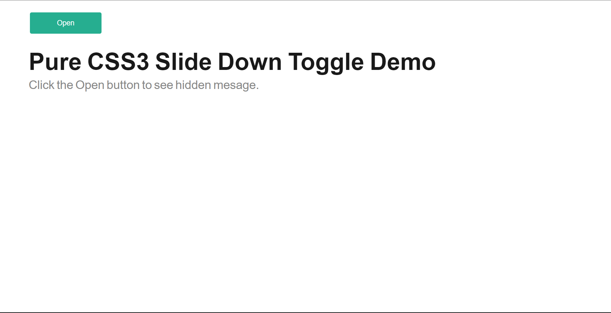](https://codepen.io/Vikash-Gorai/pen/QWYbpVm)
[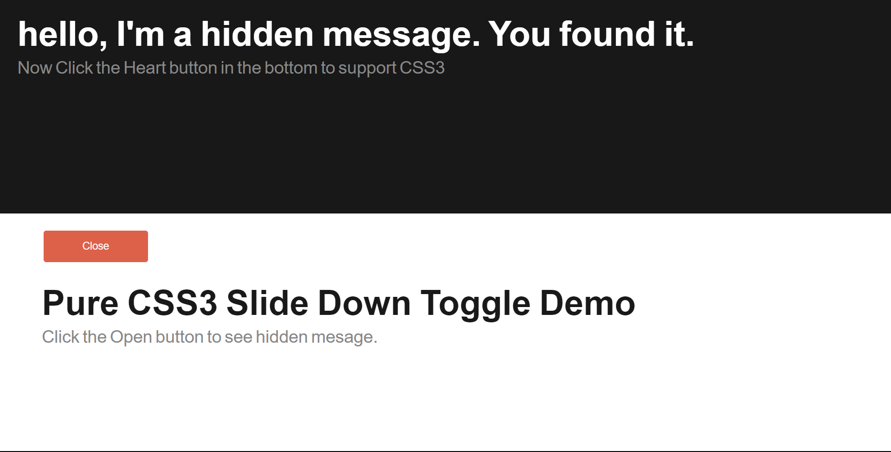](https://codepen.io/Vikash-Gorai/pen/QWYbpVm)

**[⬆ back to top](#quick-links)**


## <a id="Accordion"></a>Accordion / Toggle

[](http://www.mraffaele.com/labs/css-only-accordions/)
[](http://codepen.io/cristina-silva/pen/pyXQrj)
[](http://codepen.io/PaulZi/pen/zBbVvV)
[](http://codepen.io/ekrof/pen/YqmXdQ)

**[⬆ back to top](#quick-links)**

---

&nbsp;

## <a id="Animated-Buttons"></a>Animated Buttons

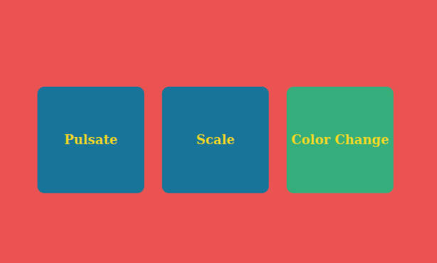
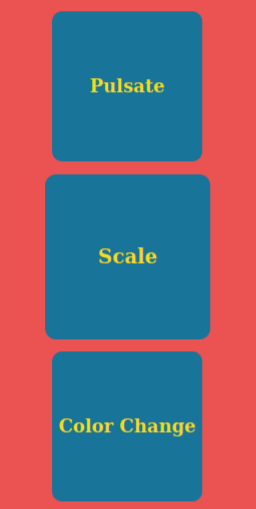
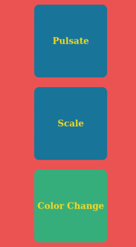
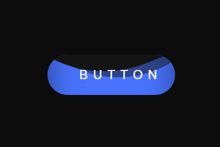

**[⬆ back to top](#quick-links)**

---

---

&nbsp;

## <a id="captain"></a>Captain America Shield


**[⬆ back to top](#quick-links)**

---

&nbsp;

## <a id="Carousel"></a>Carousel

[](http://codepen.io/SitePoint/pen/MyPVdK)
[](https://codepen.io/cavico/pen/yOjwya)
[](https://codepen.io/FabianK/pen/zJLLrR)
[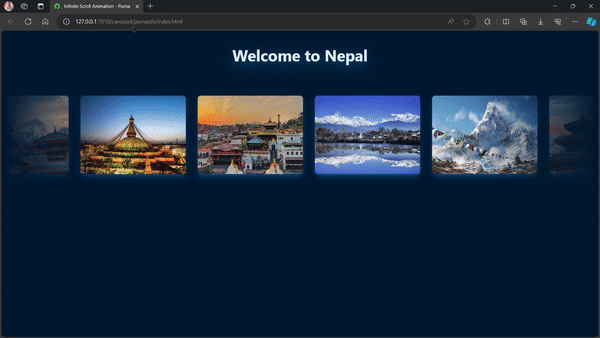](https://codepen.io/purnaaa/pen/NWoWeBB)

**[⬆ back to top](#quick-links)**

---

&nbsp;

## <a id="Counter"></a>Counter of checked check-boxes

[](https://codepen.io/anon/pen/eZWXOZ)
[](http://codepen.io/lonekorean/pen/wKbzv)

**[⬆ back to top](#quick-links)**

---

&nbsp;

## <a id="Flip"></a>Flip on click

[](https://codepen.io/RuudBurger/pen/bwjry)

**[⬆ back to top](#quick-links)**

---

&nbsp;

## <a id="Flip"></a>Flip on click

[](https://codepen.io/TAPAS-SINGHAL/pen/abXZNWR)

**[⬆ back to top](#quick-links)**

---

&nbsp;

## <a id="Flip"></a>Flip on click

[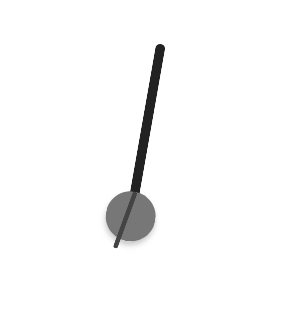](https://codepen.io/TAPAS-SINGHAL/pen/ZEwOGjj)

**[⬆ back to top](#quick-links)**

---

&nbsp;


## <a id="Animated Box"></a>Animated Box

[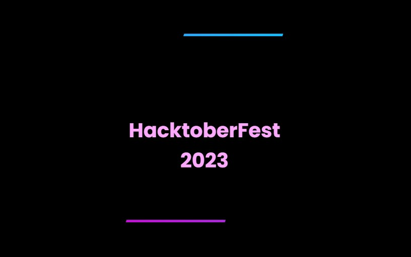](https://codepen.io/Ayan-Saxena/pen/qBgBYoZ)
[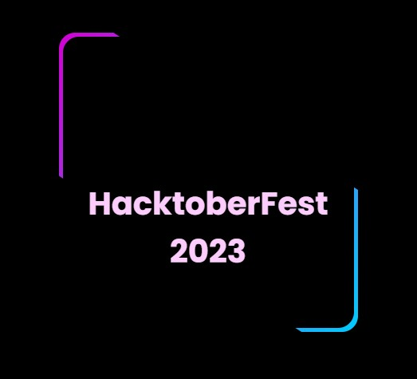](https://codepen.io/Ayan-Saxena/pen/qBgBYoZ)


**[⬆ back to top](#quick-links)**


## <a id="analogclock"></a>Analog-clock

[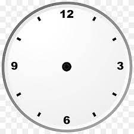](https://codepen.io/himadeepthi-sayani/pen/RwvNqQm)

**[⬆ back to top](#quick-links)**

---

&nbsp;


[](http://codepen.io/KtorZ/pen/ZOzdqG)

**[⬆ back to top](#quick-links)**

---

&nbsp;

## <a id="Font"></a>Font-Face (Latin)

[](https://yusugomori.com/projects/css-sans/fonts)

**[⬆ back to top](#quick-links)**

---

&nbsp;

## <a id="Info"></a>Info on hover/ Popover

[](https://codepen.io/monika-sivakumar/pen/rNoqxVX)
[](http://codepen.io/cristina-silva/pen/XXOpga)
[](http://codepen.io/SitePoint/pen/akAmPw)
[](http://codepen.io/ekrof/pen/YqmXdQ)

**[⬆ back to top](#quick-links)**

---

&nbsp;

## <a id="Image"></a>Image Gallery

[](https://codepen.io/shaishgandhi/pen/yJzamw)
[](http://codepen.io/pavlovsk/pen/sjubp)
[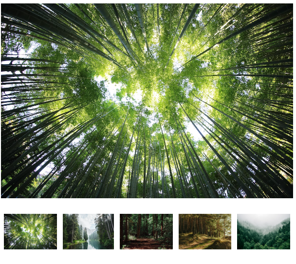](https://codepen.io/olgamozejko/pen/yLjwyye)
[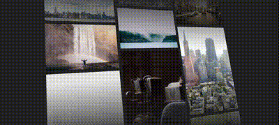]()
[]()

**[⬆ back to top](#quick-links)**

---

&nbsp;

## <a id="Loaders"></a>Loaders

[](http://codepen.io/lucadem1313/pen/vKWqRV)
[](http://codepen.io/lucadem1313/pen/XKzLER)
[](http://codepen.io/brunjo/pen/xbwVXJ)
[](http://codepen.io/brunjo/pen/ByjRPy)
[](http://codepen.io/brunjo/pen/LEGyrJ)
[](http://codepen.io/brunjo/pen/bNEWjV)
[](http://codepen.io/brunjo/pen/wBKmbm)
[](http://tobiasahlin.com/spinkit/)
[](http://codepen.io/viduthalai1947/pen/JkhDK)
[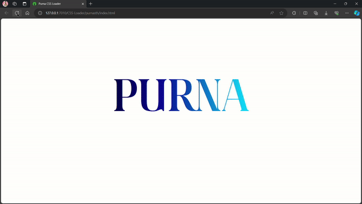](https://codepen.io/purnaaa/pen/vYVVygB)
[](https://codepen.io/Sahil-Patil-the-sans/pen/WNPbVqK)

**[⬆ back to top](#quick-links)**

---

&nbsp;

## <a id="DropdownMenu"></a>Dropdown Menu

[](https://codepen.io/antoniputra/pen/BzyWmb)
[](http://codepen.io/cristina-silva/pen/NNOodj)

**[⬆ back to top](#quick-links)**

---

&nbsp;

## <a id="Mobile"></a>Mobile menu off canvas

[](https://codepen.io/fabricionaweb/pen/xOLwxj)

**[⬆ back to top](#quick-links)**

---

&nbsp;

## <a id="BurgerMenu"></a>Burger Menu

[](https://codepen.io/eduardoboucas/pen/BNyKwO)

**[⬆ back to top](#quick-links)**

---

&nbsp;

## <a id="button_letsgo"></a>Button Animation

[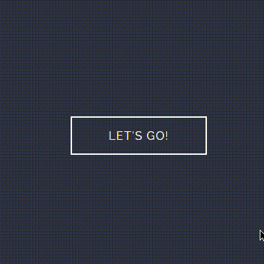](<[https://codepen.io/eduardoboucas/pen/BNyKwO](https://codepen.io/Aman-Pathan-the-typescripter/pen/MWLYNNx)>)

**[⬆ back to top](#quick-links)**

---

&nbsp;

## <a id="compassloader"></a>Compass Loader

[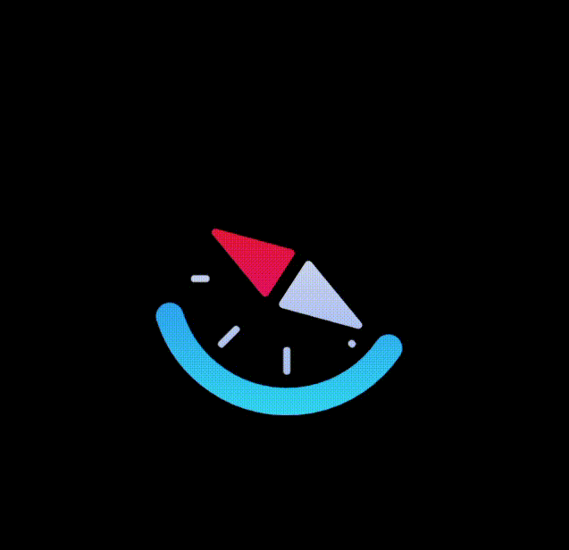](<[https://codepen.io/eduardoboucas/pen/BNyKwO](https://codepen.io/Aman-Pathan-the-typescripter/pen/dyaPmrE)>)

**[⬆ back to top](#quick-links)**

---

&nbsp;

## <a id="FancyMenu"></a>Fancy Menu

[](http://codepen.io/lbebber/pen/RNgBPP)

**[⬆ back to top](#quick-links)**

---

&nbsp;

## <a id="footer"></a>Footer

[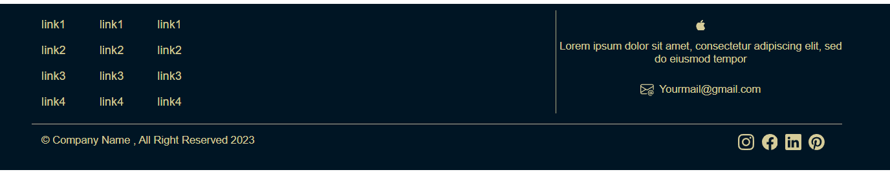](https://codepen.io/janup2442/pen/qBgBBKz)
[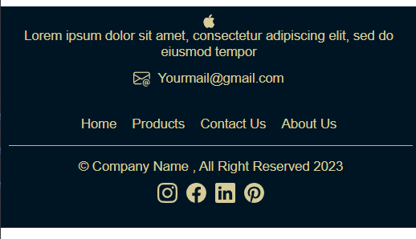](https://codepen.io/janup2442/pen/qBgBBKz)

**[⬆ back to top](#quick-links)**

---

&nbsp;

## <a id="Modal"></a>Modal/Popup

[](https://codepen.io/peiche/pen/vhqym)
[](https://codepen.io/chrisburnell/pen/scyKF)

**[⬆ back to top](#quick-links)**

---

&nbsp;

## <a id="Mouse"></a>Mouse tracking

[](https://codepen.io/Momciloo/pen/GoGRrQ)
[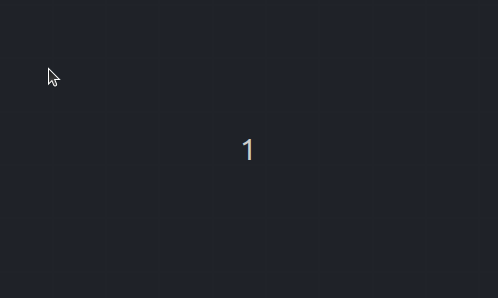](https://codepen.io/masterujjval/pen/xxmBRJV)

**[⬆ back to top](#quick-links)**

---

&nbsp;

---

## <a id="navBar"></a>NavBar

[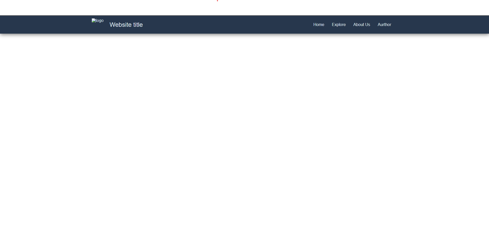](https://codepen.io/janup2442/pen/QWzPRQQ)

**[⬆ back to top](#quick-links)**

---

&nbsp;

## <a id="Parallax"></a>Parallax scrolling

[](http://keithclark.co.uk/articles/pure-css-parallax-websites/demo3/)

**[⬆ back to top](#quick-links)**

---

&nbsp;

## <a id="Tabs"></a>Tabs

[](https://codepen.io/llgruff/pen/ZGBxOa)
[](https://codepen.io/fusco/pen/Wvzjrm)

**[⬆ back to top](#quick-links)**

---

&nbsp;

## <a id="Todo"></a>Todo List

[](https://codepen.io/SamsShow/pen/NWeerXr)


**[⬆ back to top](#quick-links)**

---

&nbsp;

## <a id="Tooltips"></a>Tooltips

- [Demo](https://kushagragour.in/lab/hint/)

## <a id="Treeview"></a>Treeview

[](https://codepen.io/rgg/pen/WrKyzj)

**[⬆ back to top](#quick-links)**

---

&nbsp;

## <a id="Twitter"></a>Twitter Heart Animation

[](http://codepen.io/thebabydino/pen/RRRRZE)

**[⬆ back to top](#quick-links)**

---

&nbsp;

## <a id="BookAnimation"></a>Book Animation

[](https://codepen.io/Paras-Shenmare/pen/eYxJpQB)

**[⬆ back to top](#quick-links)**

---

&nbsp;

## <a id="ImageColorizing"></a>Dynamic Image Colorizing

[](http://codepen.io/noahblon/pen/ZbjmbK)

**[⬆ back to top](#quick-links)**

---

&nbsp;

## <a id="DarkMode"></a>DarkMode

[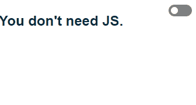](https://codepen.io/marcelesilv/pen/yLjrEzz)

**[⬆ back to top](#quick-links)**

&nbsp;

## <a id="RippleEffect"></a>Ripple Effect

[](http://mladenplavsic.github.io/css-ripple-effect/)

**[⬆ back to top](#quick-links)**

---

&nbsp;

## <a id="ResponsiveItemShowcase"></a>Responsive Counter Showing # of Items That Didn't Fit Screen

[](https://codepen.io/pavlovsk/pen/QqrZzv/right/)

**[⬆ back to top](#quick-links)**

---

&nbsp;

## <a id="login"></a>A login Page with Glassmorphism Effect

[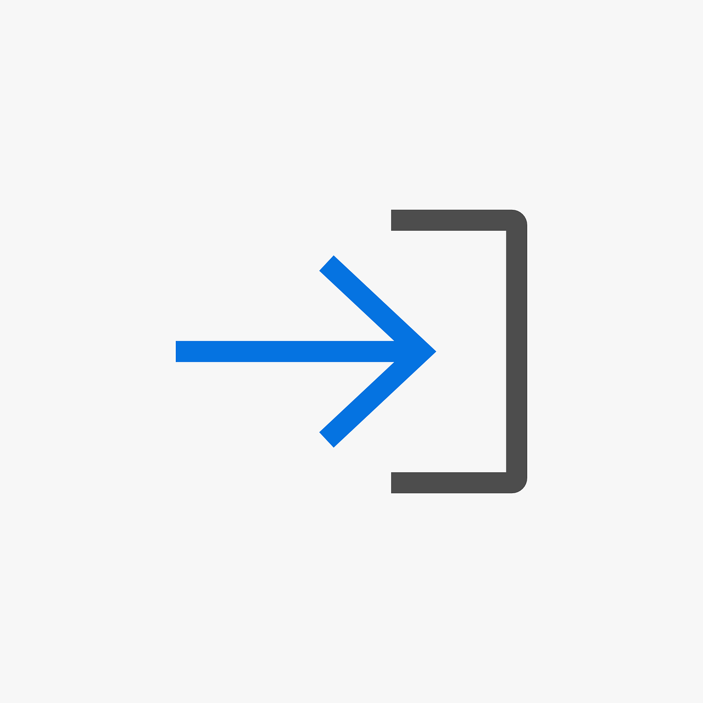]

**[⬆ back to top](#quick-links)**

---

&nbsp;


&nbsp;

## <a id="NeumorphismCardDesign"></a>Neumorphism Card Design

[](https://codepen.io/saviomartin/pen/LYNgqKW)

**[⬆ back to top](#quick-links)**

---

&nbsp;

## <a id="neon-button"></a>Neon Button

[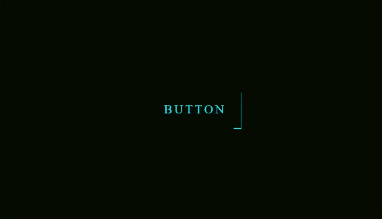](https://codepen.io/nikhilkalburgi/pen/WNyeopW)
[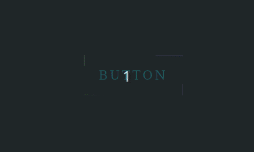](https://codepen.io/masterujjval/pen/MWZMZbw)
**[⬆ back to top](#quick-links)**

---

&nbsp;

## <a id="neon-card"></a>Neon Card

[](examples/neon-card-2.html)
**[⬆ back to top](#quick-links)**

---

&nbsp;

## <a id="shake-button"></a>Shake Button

[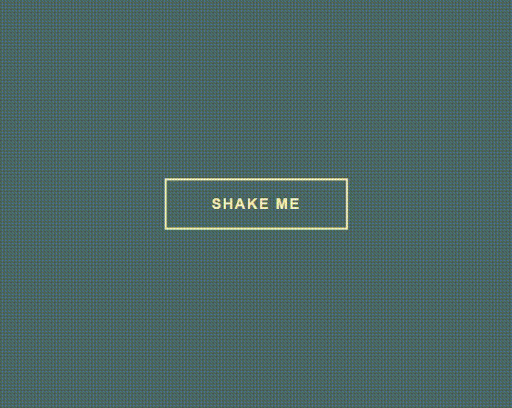](https://codepen.io/krushnarout/pen/zYyLEmM)

**[⬆ back to top](#quick-links)**

## <a id="moving_hand"></a>Shake Button

[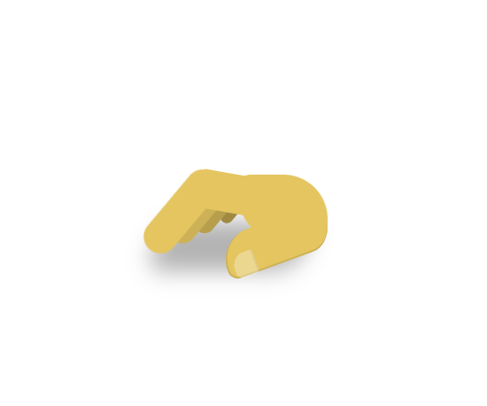](examples/Moving_hand.html)

**[⬆ back to top](#quick-links)**

---

&nbsp;

## <a id="Dog-Animation"></a>Dog Box Animation

[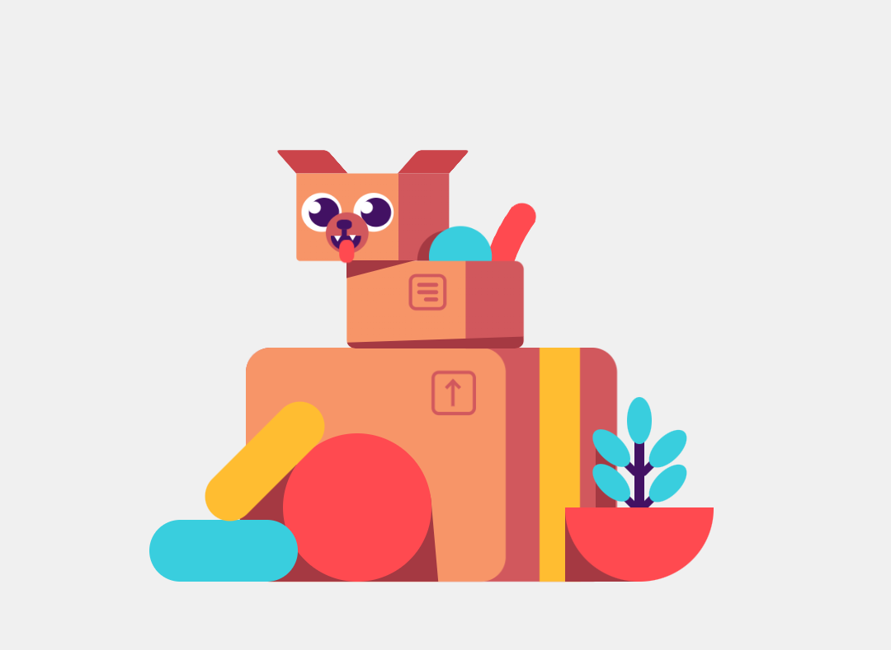](https://github.com/you-dont-need/You-Dont-Need-JavaScript/assets/101883389/b8321f82-ee84-4e4a-9010-62a5f4afc45a)

**[⬆ back to top](#quick-links)**

---

&nbsp;

## <a id="Thankyou-Animation"></a>Thankyou-Animation

[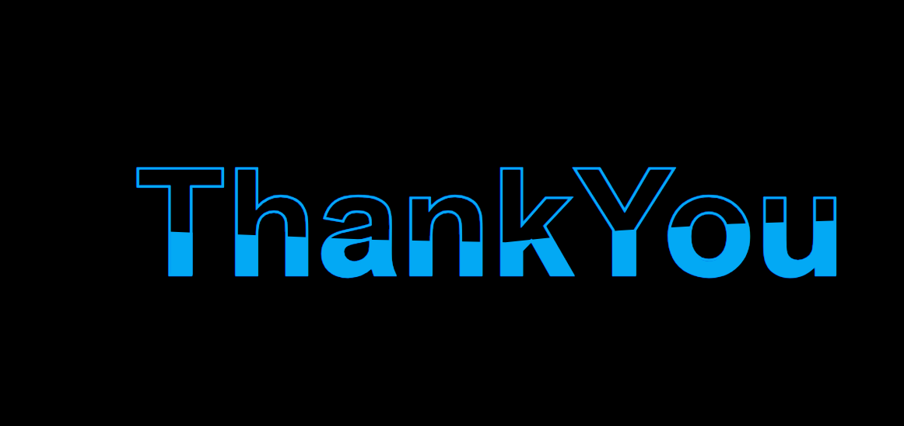](https://github.com/you-dont-need/You-Dont-Need-JavaScript/assets/101883389/5e37601d-dce5-4326-b22a-c7d4f1c6d16f)

**[⬆ back to top](#quick-links)**

---


&nbsp;

## <a id="Square_roation_animation"></a>Square_rotation_animation (Latin)

[](demoLink)

**[⬆ back to top](#quick-links)**

---

&nbsp;

## <a id="Switch"></a>Switch

[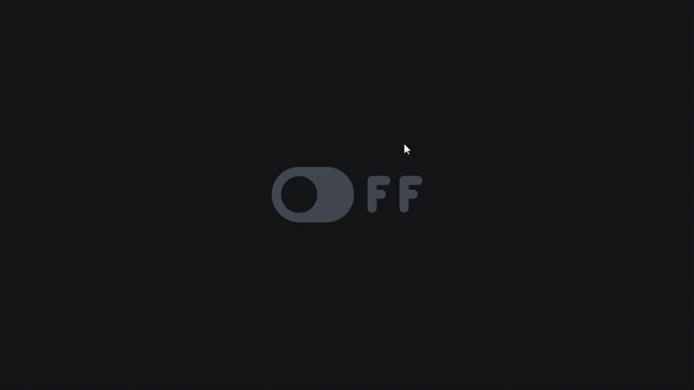](https://github.com/Dreadlord075/You-Dont-Need-JavaScript/blob/d581e4061af20aa2e2dbf0c11a8860c3fe768245/images/Switch.gif)

**[⬆ back to top](#quick-links)**

---

&nbsp;

## <a id="bonfire"></a>Bonfire

[](https://github.com/Dreadlord075/You-Dont-Need-JavaScript/blob/d581e4061af20aa2e2dbf0c11a8860c3fe768245/images/Bonfire.gif)

**[⬆ back to top](#quick-links)**

---

&nbsp;

## <a id="scenary"></a>Scenary

[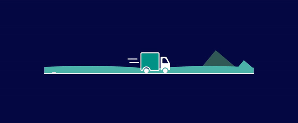](https://github.com/you-dont-need/You-Dont-Need-JavaScript/assets/97428742/5943c92d-c9d3-401e-a8dd-88091a1d839d)

**[⬆ back to top](#quick-links)**

---

&nbsp;

## <a id="bubble"></a>Bubble

[](https://github.com/you-dont-need/You-Dont-Need-JavaScript/assets/97428742/17b72752-9010-4433-9d1e-b9a24a8f5222)

**[⬆ back to top](#quick-links)**

---

&nbsp;

## <a id="flower"></a>Flower

[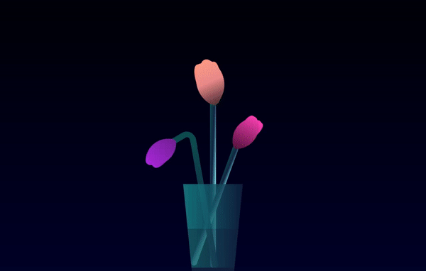](https://github.com/you-dont-need/You-Dont-Need-JavaScript/assets/97428742/4ca880e9-47b9-4df5-b484-6e2a955ec266)

**[⬆ back to top](#quick-links)**

---

&nbsp;

## <a id="JumpingBall"></a>Jumping Ball

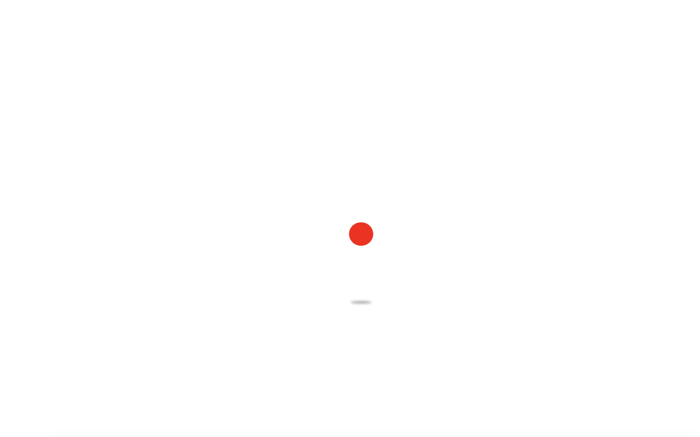

**[⬆ back to top](#quick-links)**

---

&nbsp;

## <a id="LightBulbAnimation"></a>Light Bulb Animation

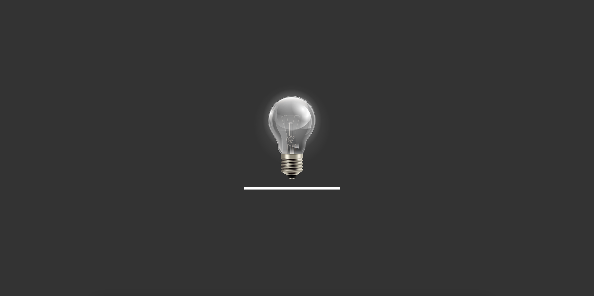

**[⬆ back to top](#quick-links)**

---

&nbsp;

## <a id="city-animation-footer"></a>City animation footer

[](https://github.com/Dreadlord075/You-Dont-Need-JavaScript/blob/d581e4061af20aa2e2dbf0c11a8860c3fe768245/images/City%20animation%20footer.gif)

**[⬆ back to top](#quick-links)**

---

&nbsp;

## <a id="smoke"></a>Smoke

[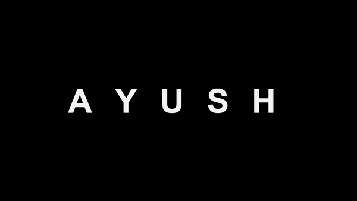](https://github.com/you-dont-need/You-Dont-Need-JavaScript/assets/97428742/d6a4f0b5-5345-4a23-85ae-6c371f597c61)

**[⬆ back to top](#quick-links)**

---

&nbsp;

## <a id="loader"></a>Loader

[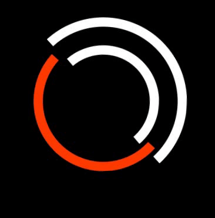](https://github.com/you-dont-need/You-Dont-Need-JavaScript/assets/97428742/97ba01f5-7e85-4c3e-8d60-47374ef3a1f9)

**[⬆ back to top](#quick-links)**

---

&nbsp;

## <a id="spiner"></a>Spiner

[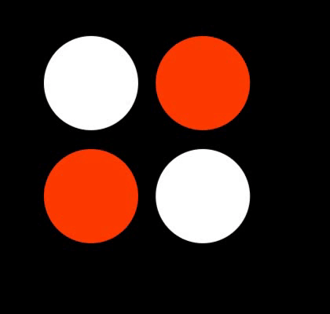](https://github.com/you-dont-need/You-Dont-Need-JavaScript/assets/97428742/72b2e6fc-d12b-423b-a1a7-2d705e111e1f)

**[⬆ back to top](#quick-links)**

---

&nbsp;

## <a id="fire"></a>Fire

[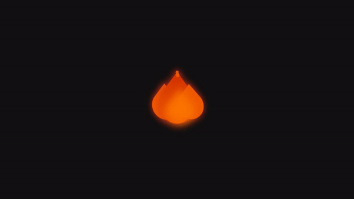](https://github.com/you-dont-need/You-Dont-Need-JavaScript/assets/97428742/85e70774-0da0-47bf-bbea-1b6d2d6d73e1)

**[⬆ back to top](#quick-links)**

---

&nbsp;

## <a id="flame"></a>Flame

[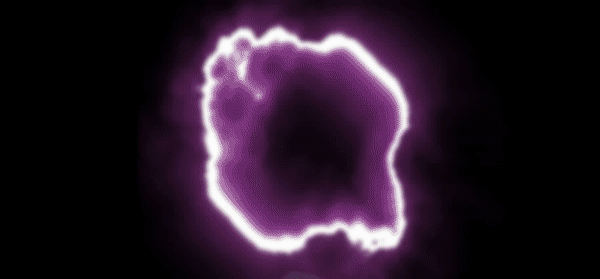](https://github.com/you-dont-need/You-Dont-Need-JavaScript/assets/97428742/5d8659ea-84e4-481e-bdcd-e5e9fe7d30e9)

**[⬆ back to top](#quick-links)**

---

## <a id="shuffling-squres"></a>Shuffling squares

[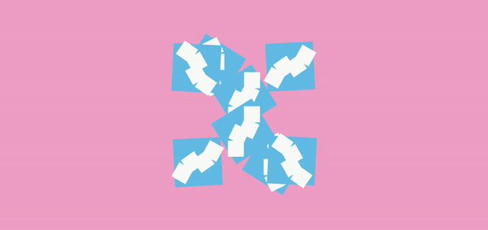](https://im3.ezgif.com/tmp/ezgif-3-41efb679c2.gif)

---

## <a id="Floating-labelV2"></a>Floating-labelV2

[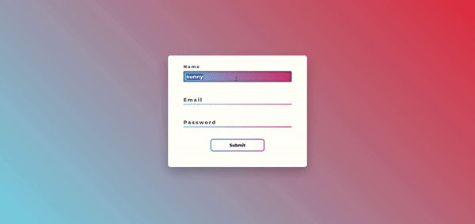](https://im2.ezgif.com/tmp/ezgif-2-3297933621.gif)

**[⬆ back to top](#quick-links)**

---

## <a id="scary-animation"></a>scary-animation

[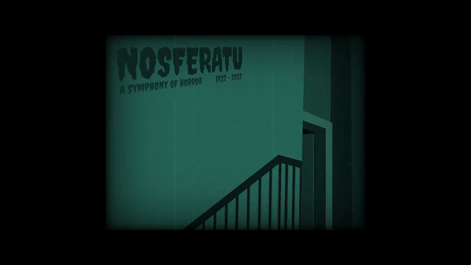](https://im4.ezgif.com/tmp/ezgif-4-04e4dfec68.gif)

**[⬆ back to top](#quick-links)**

---

## <a id="infinite-carousel"></a>infinite-carousel

# [](https://im4.ezgif.com/tmp/ezgif-4-cf03115fc6.gif)

[](https://im4.ezgif.com/tmp/ezgif-4-04e4dfec68.gif)

=======

> > > =======

[](https://im4.ezgif.com/tmp/ezgif-4-04e4dfec68.gif)

**[⬆ back to top](#quick-links)**

---

## <a id="growing-flower"></a>growing-flower

[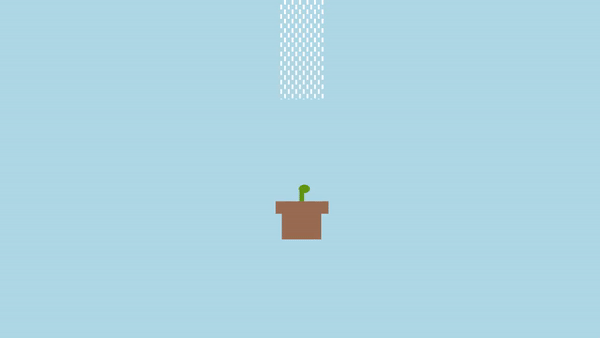](https://im3.ezgif.com/tmp/ezgif-3-f53ebce80a.gif)

**[⬆ back to top](#quick-links)**

---

&nbsp;

## <a id="playing-card"></a>Playing Card Animation

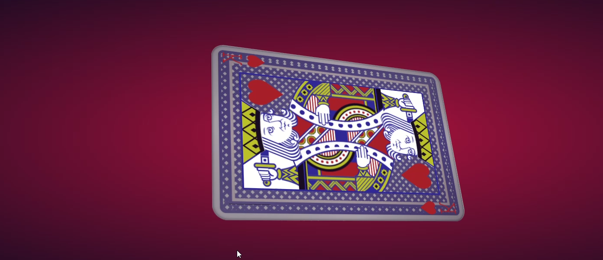

**[⬆ back to top](#quick-links)**

---

## <a id="starwarsintro"></a>Star Wars Intro

[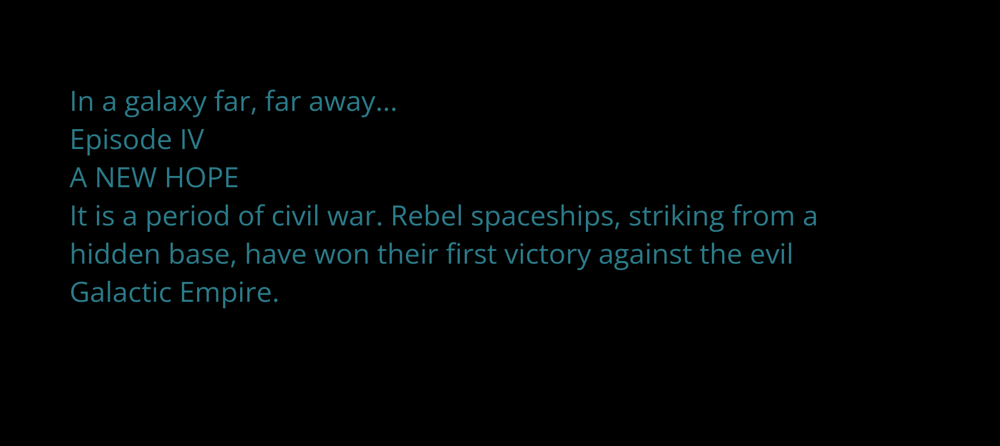](https://codepen.io/kdwzrjtc-the-animator/pen/MWLgBRz)
[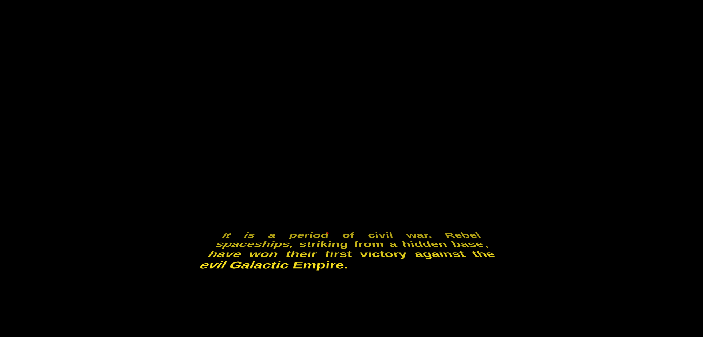](https://codepen.io/kdwzrjtc-the-animator/pen/MWLgBRz)

**[⬆ back to top](#quick-links)**

## <a id= "Gradient-Animation"></a>Gradient Animation

[](https://github.com/you-dont-need/You-Dont-Need-JavaScript/blob/b3b64a1d4a426ab3a8f20fbe34640de18bca14a5/images/gradient-animation.gif)

**[⬆ back to top](#quick-links)**

## <a id="zoom-when-hover"></a>Zoom when hover

[](https://codepen.io/kdwzrjtc-the-animator/pen/gOqOwLx)

---

## <a id="Floating-labelV2"></a>Floating-labelV2

[](https://im2.ezgif.com/tmp/ezgif-2-3297933621.gif)

**[⬆ back to top](#quick-links)**

---

## <a id= "Css Tables"></a>CSS Tables

## 

=======

## <a id= "3D Transform"></a>3D Transform

## 

## <a id="animated-btn"></a>Animated Button

**[⬆ back to top](#quick-links)**

---

## <a id= "Css FLEX"></a>Css FLEX

## 

&nbsp;

## <a id="Coffee-Animation"></a>Coffee-Animation

[](https://github.com/you-dont-need/You-Dont-Need-JavaScript/assets/101883389/7d15c275-5210-4c2e-8530-eb073251a39f)

**[⬆ back to top](#quick-links)**


=======
&nbsp;

## <a id="Basketball-Animation"></a>Basketball-Animation

[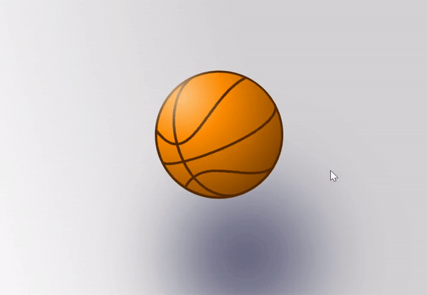](https://github.com/you-dont-need/You-Dont-Need-JavaScript/assets/101883389/66759afd-9794-408d-92a5-53b793072f98)

**[⬆ back to top](#quick-links)**

=======
&nbsp;

## <a id="Business-Card"></a>Business-Card

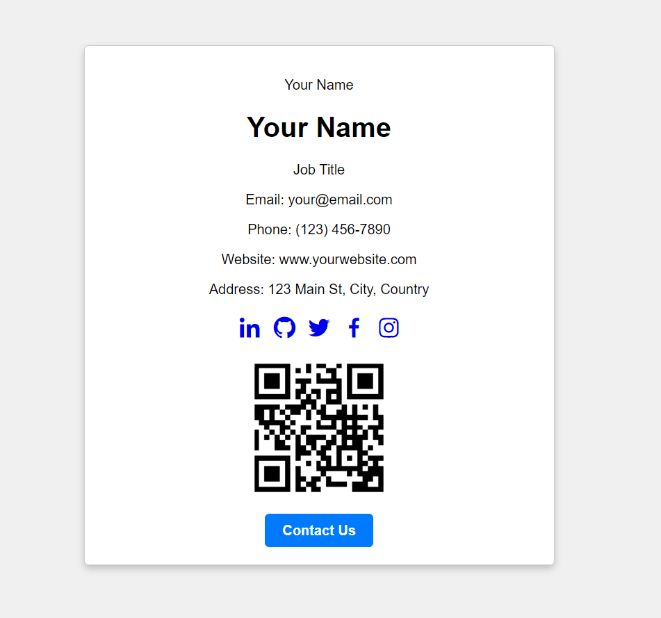

**[⬆ back to top](#quick-links)**

=======
&nbsp;


## <a id="SolarSystem"></a>SolarSystem

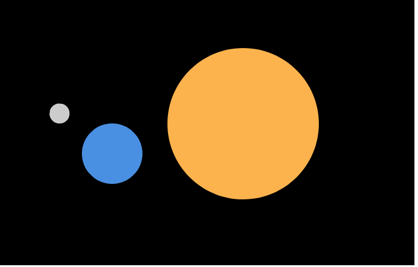

**[⬆ back to top](#quick-links)**
=======
&nbsp;

## <a id="Pendulum"></a>Pendulum


**[⬆ back to top](#quick-links)**
=======
&nbsp;


## <a id="SlicedButton"></a>SlicedButton

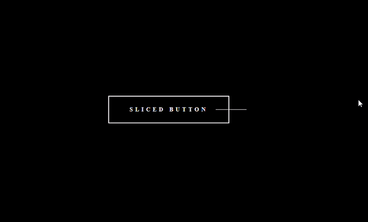

**[⬆ back to top](#quick-links)**
=======
&nbsp;

## <a id="Rating Star"></a>Rating Star


**[⬆ back to top](#quick-links)**
=======
&nbsp;

## <a id="DVDScreenSaver"></a>DVD Screen Saver


**[⬆ back to top](#quick-links)**
=======
&nbsp;

## <a id="RotateSquare"></a>RotateSquare

[]

**[⬆ back to top](#quick-links)**
```
=======
&nbsp;

---

## Contributors

Thanks to these wonderful people who have contributed to this project!

<a href="https://github.com/you-dont-need/You-Dont-Need-JavaScript/graphs/contributors">
  
</a>

## Contributing

We welcome contributions from the community to make this project better. Feel free to fork the repository, make your changes, and submit a pull request. Be sure to follow our [Code of Conduct](CODE_OF_CONDUCT.md).

For detailed guidelines on how to contribute, please refer to our [CONTRIBUTING](CONTRIBUTING.md) file.

Let's build something great together!
